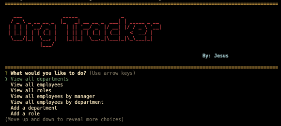

## TRACK YOUR ORGANIZATION  
## Description
Whether youre working from home without the benefit of a full office setup, traveling for work or juggling multiple responsibilities, running a small business requires taking care of many tasks on the go. This is a quick and easy way owners could locally keep track of their originzation. Easy Content Management System. 

## Mock Up 
 
## User Story
  
```
AS A business owner
I WANT to be able to view and manage the departments, roles, and employees in my company
SO THAT I can organize and plan my business
```
  
## Acceptance Criteria
  
``` 
GIVEN a command-line application that accepts user input
WHEN I start the application
THEN I am presented with the following options: view all departments, view all roles, view all employees, add a department, add a role, add an employee, and update an employee role
WHEN I choose to view all departments
THEN I am presented with a formatted table showing department names and department ids
WHEN I choose to view all roles
THEN I am presented with the job title, role id, the department that role belongs to, and the salary for that role
WHEN I choose to view all employees
THEN I am presented with a formatted table showing employee data, including employee ids, first names, last names, job titles, departments, salaries, and managers that the employees report to
WHEN I choose to add a department
THEN I am prompted to enter the name of the department and that department is added to the database
WHEN I choose to add a role
THEN I am prompted to enter the name, salary, and department for the role and that role is added to the database
WHEN I choose to add an employee
THEN I am prompted to enter the employee’s first name, last name, role, and manager and that employee is added to the database
WHEN I choose to update an employee role
THEN I am prompted to select an employee to update and their new role and this information is updated in the database 
```
## Installation 
`npm init`

`npm i chalk`

`npm i console.table`

`npm i dotenv`

`npm i figlet`

`npm i inquirer`

`npm i mysql2`

`npm i nodemon` update package.json  ` "watch":"nodemon server.js"`

`npm i promise-mysql`

## Usage
-CREATE A .ENV FILE

`DB_NAME=all_employees`

`DB_USER=root`

`DB_PW=____________`

- TERMINAL $alias mysql=/usr/local/mysql/bin/mysql--
- TERMINAL $mysql -u root -p
- TERMINAL $show databases;
- TERMINAL $create database all_employees;
- TERMINAL $source db/schema.sql;
- TERMINAL $source db/seeds.sql;
- TERMINAL $exit 
- TERMINAL $node server.js